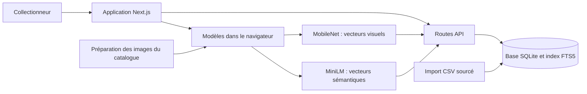
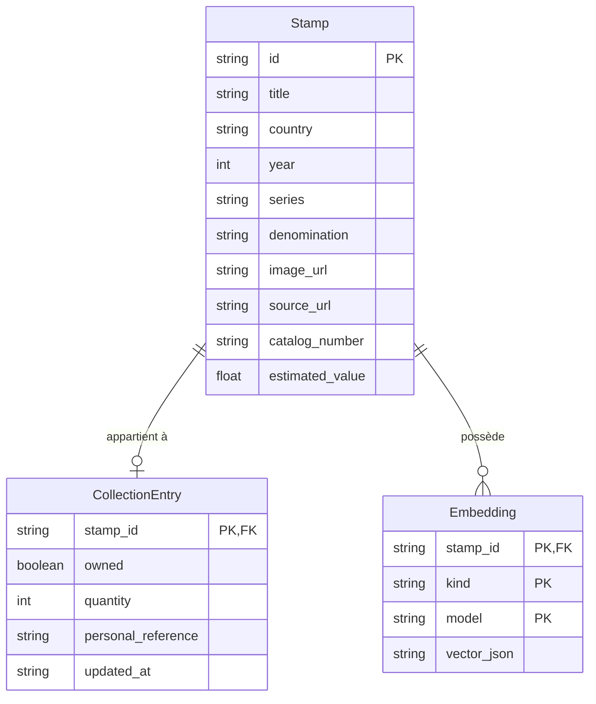

# Conception

- Application personnelle : un serveur, une collection, sans comptes utilisateurs.
- SQLite conserve les notices, les quantités et les vecteurs liés à la version des modèles.
- Les photos restent dans le navigateur ; seuls les vecteurs sont transmis à la recherche.

